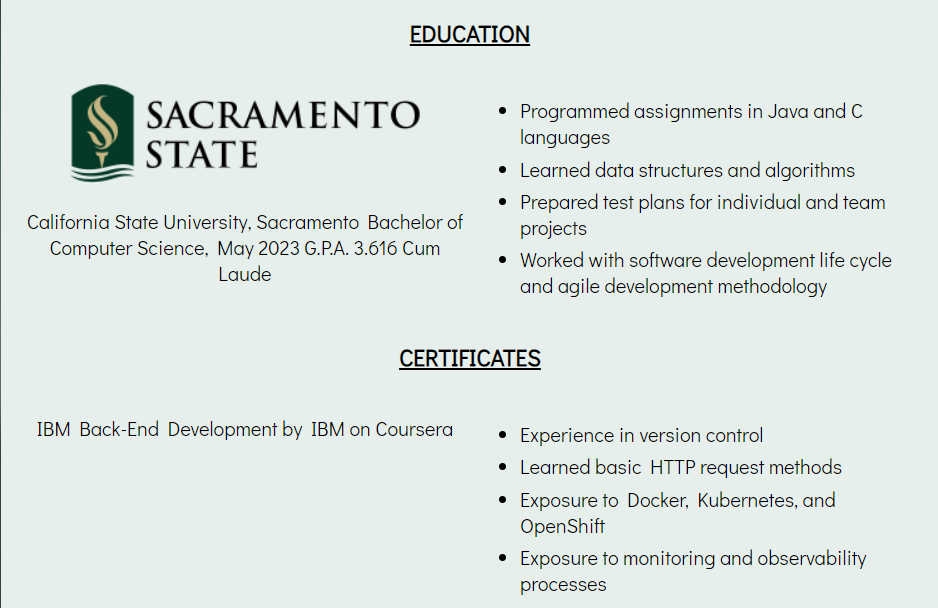

# Portfolio Version 1

## About The Project
This is the first version of my portfolio website. Its main purpose was to be a place to showcase my other projects, share my background and skill set, and provide contact information for visitors.

When I began applying for software engineering jobs, I wanted a place for potential employers and hiring managers to have an opportunity to view my work and learn more about me beyond what I could put in a resume. While this project is not complicated as far as functionality goes, my portfolio's layout, design, and responsive styling called for a more thoughtful approach.

The biggest challenges was designing the layout of each page and making the portfolio properly stylized for all screen sizes. But with flexbox and responsive CSS, I was able to make a portfolio site that was suitable for most viewers. While this version is no longer being maintained, this project made me a more thoughtful designer and planner.

### Built With
- HTML
- CSS
- JavaScript

## Usage
This project's features are primarily for navigational purposes. The header contains a time and date widget, as well as the navigation bar. The navigation bar leads to four pages: Home, About, Projects, and Contact.

The footer contains my email, LinkedIn profile, and GitHub page.

Each page has a header and a footer with the same content.

### Home
The home page is the initial page that displays general information about me. In order, the page contains:
- A short introduction
- List of projects
- Tech stack
- Education and certificates

The introduction is a brief greeting for the viewer. It shares some of my background and encourages the viewer to browse the rest of the page.

This section hosts some projects that I've done. It's purpose is to prove the skills I've learned by allowing viewers to use my projects. At the time of development, I only had one other project included.

The skills section is a small portion of the home page that uses icons to show what technologies I am familiar with. The technologies I advertised were based on my experience with projects and education background.

The last section shows my educational background. This is where I put down my bachelor degree and certificates, as well as what I've learned from each.

### About

The about page is where I tell a little bit about my background, passion, and work philosophy. Aside from the header and footer, there is no other content.

### Project

The project page is a place where my projects would be displayed and available for viewers to try. Each project widget has a short description, technologies used to develop the project, skills learned, and links to try the project as well as the code repository on GitHub. Projects here appear the same as they did on the Home page.

Below the projects is my tech stack and a small description of my experience with front-end technologies and process.

### Contact

The contact page contains two widgets that encourages the viewer to either check out my LinkedIn page or send an email.

## Credits
- [15 Web Developer Portfolios to Inspire You](https://www.freecodecamp.org/news/15-web-developer-portfolios-to-inspire-you-137fb1743cae/ "FreeCodeCamp") : Inspiration for portfolio websites
- [GitHub Pages](https://pages.github.com/ "GitHub Pages") : Used to host project online
- [Font Awesome](https://fontawesome.com/ "Font Awesome") : Used for icons
- [Google Fonts](https://fonts.google.com/ "Google Fonts") : Used for Didact Gothic font